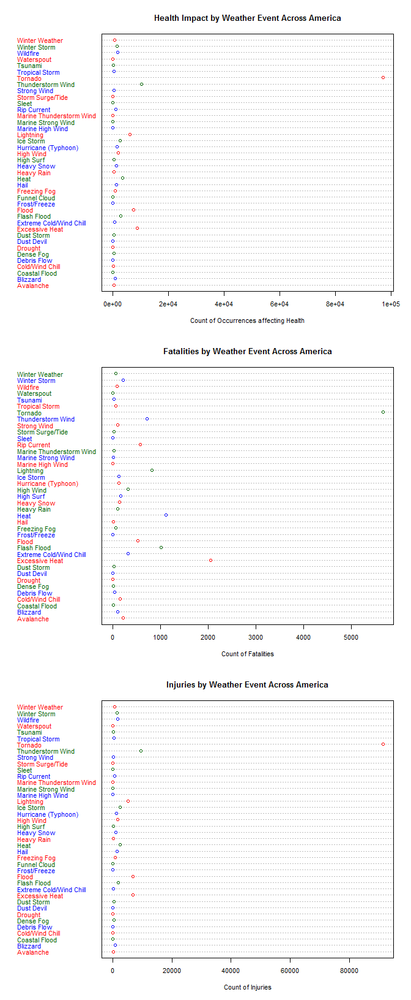

# Effects of Severe Weather Events Across America
Calvin Seto  
July 26, 2015  

# Synopsis
This document attempts to identify the most catastrophic weather events America has faced during the past 60 years and the impact on the population health and economic well-being.  A Google search of "natural disasters in america" returns answers such as hurricane, drought, fire and earthquake, heat wave, flood, and tornado.  The Storm Events Database contains information from 1950 to November 2011 and has undergone major changes in order to fix data inconsistencies.  It's expected that some effort will be necessary to clean and tidy data set variables such as event type, fatalities, injuries, property damage, property damage units, crop damage, and crop damage units.  We also need to use some common sense to exclude some data which doesn't appear to have a huge impact, but we'll be sure to consult with an expert about this and the data cleaning rules. After creating subsets that further refine the data, we'll create dot plots for health, fatalities, injuries, economic, property, and crop damage for each of the 48 permissible event types specified in National Weather Service Instruction document 10-1605.  The following table shows the top three weather events impacting America in each area, from health to crop damage.


                  First                 Second              Third               
----------------  --------------------  ------------------  --------------------
Health            Tornado               Thunderstorm Wind   Excessive Heat      
Fatalities        Tornado               Excessive Heat      Heat                
Injuries          Tornado               Thunderstorm Wind   Flood               
Economic          Hurricane (Typhoon)   Tornado             Storm Surge/Tide    
Property Damage   Hurricane (Typhoon)   Tornado             Storm Surge/Tide    
Crop Damage       Drought               Flood               Hurricane (Typhoon) 

# Data Processing
The data can be downloaded from the [project web site](https://d396qusza40orc.cloudfront.net/repdata%2Fdata%2FStormData.csv.bz2) as a bzip compressed file and it is saved to the local disk as StormData.csv.bz2, in the working directory's data folder.  We'll load the CSV file with read.csv() and use bzfile() to access the bzip file without uncompressing it.  To make grouping and summarizing easier, we'll configure dplyr.

```r
mydf <- read.csv(bzfile("./data/StormData.csv.bz2"),header=TRUE,sep=",")
library(dplyr)
storm <- tbl_df(mydf)
rm("mydf")
```

As we explore the data set, we see its size, the first few rows of data, and identify variables that can help us answer our questions: BGN_DATE, COUNTY, STATE, EVTYPE, END_DATE, FATALITIES, INJURIES, PROPDMG, PROPDMGEXP, CROPDMG, CROPDMGEXP, REMARKS, and REFNUM.

To help calculate property and crop damage later, we'll create two variables called cleanPROPDMG and cleanCROPDMG.
  
To see how many events were recorded in the Storm Database, let's create a table of event counts by year from 1950 to 2011.
We create the 5 number summary and a few rows of data from the number of weather events counted over the years.

```r
library(dplyr)
dim(storm)
```

```
## [1] 902297     37
```

```r
head(storm)
```

```
## Source: local data frame [6 x 37]
## 
##   STATE__           BGN_DATE BGN_TIME TIME_ZONE COUNTY COUNTYNAME STATE
## 1       1  4/18/1950 0:00:00     0130       CST     97     MOBILE    AL
## 2       1  4/18/1950 0:00:00     0145       CST      3    BALDWIN    AL
## 3       1  2/20/1951 0:00:00     1600       CST     57    FAYETTE    AL
## 4       1   6/8/1951 0:00:00     0900       CST     89    MADISON    AL
## 5       1 11/15/1951 0:00:00     1500       CST     43    CULLMAN    AL
## 6       1 11/15/1951 0:00:00     2000       CST     77 LAUDERDALE    AL
## Variables not shown: EVTYPE (fctr), BGN_RANGE (dbl), BGN_AZI (fctr),
##   BGN_LOCATI (fctr), END_DATE (fctr), END_TIME (fctr), COUNTY_END (dbl),
##   COUNTYENDN (lgl), END_RANGE (dbl), END_AZI (fctr), END_LOCATI (fctr),
##   LENGTH (dbl), WIDTH (dbl), F (int), MAG (dbl), FATALITIES (dbl),
##   INJURIES (dbl), PROPDMG (dbl), PROPDMGEXP (fctr), CROPDMG (dbl),
##   CROPDMGEXP (fctr), WFO (fctr), STATEOFFIC (fctr), ZONENAMES (fctr),
##   LATITUDE (dbl), LONGITUDE (dbl), LATITUDE_E (dbl), LONGITUDE_ (dbl),
##   REMARKS (fctr), REFNUM (dbl)
```

```r
names(storm)
```

```
##  [1] "STATE__"    "BGN_DATE"   "BGN_TIME"   "TIME_ZONE"  "COUNTY"    
##  [6] "COUNTYNAME" "STATE"      "EVTYPE"     "BGN_RANGE"  "BGN_AZI"   
## [11] "BGN_LOCATI" "END_DATE"   "END_TIME"   "COUNTY_END" "COUNTYENDN"
## [16] "END_RANGE"  "END_AZI"    "END_LOCATI" "LENGTH"     "WIDTH"     
## [21] "F"          "MAG"        "FATALITIES" "INJURIES"   "PROPDMG"   
## [26] "PROPDMGEXP" "CROPDMG"    "CROPDMGEXP" "WFO"        "STATEOFFIC"
## [31] "ZONENAMES"  "LATITUDE"   "LONGITUDE"  "LATITUDE_E" "LONGITUDE_"
## [36] "REMARKS"    "REFNUM"
```

```r
storm$cleanPROPDMG <- NA
storm$cleanCROPDMG <- NA

library(lubridate)
totalEventsByYear <- as.data.frame(table(year(mdy_hms(storm$BGN_DATE))))
names(totalEventsByYear) <- c("year","count")
summary(totalEventsByYear$count)
```

```
##    Min. 1st Qu.  Median    Mean 3rd Qu.    Max. 
##     223    2388    5766   14550   28500   62170
```

```r
head(arrange(totalEventsByYear,desc(count)))
```

```
##   year count
## 1 2011 62174
## 2 2008 55663
## 3 2010 48161
## 4 2009 45817
## 5 2006 44034
## 6 2007 43289
```

The str() function run on the EVTYPE variable shows it is quite messy being a Factor variable with 985 levels.
Let's do a count of the event types in the database and view some of the types in decreasing count order.  There are too many messy values for EVTYPE, so we'll reclassify them using the 48 allowed values for storm data events specified in the NWSI 10-1605 document.  The idea is to create a new factor variable called cleanEventType, using a custom function makeCleanEventType() which will examine each messy EVTYPE value and map it to one of the 48 allowed values.  The strings in this function were created using the helpful features of text editors like TextMate or Notepad++, and dplyr query results.


```r
str(storm$EVTYPE)
```

```
##  Factor w/ 985 levels "   HIGH SURF ADVISORY",..: 834 834 834 834 834 834 834 834 834 834 ...
```

```r
countEventTypes <- as.data.frame(table(storm$EVTYPE))
names(countEventTypes) <- c("eventType","count")
head(countEventTypes[order(countEventTypes$count,decreasing=TRUE),])
```

```
##             eventType  count
## 244              HAIL 288661
## 856         TSTM WIND 219940
## 760 THUNDERSTORM WIND  82563
## 834           TORNADO  60652
## 153       FLASH FLOOD  54277
## 170             FLOOD  25326
```


```r
makeCleanEventType <- function(df) {
    df$cleanEventType <- factor(df$EVTYPE)
    levels(df$cleanEventType) <- list(
        "Astronomical Low Tide" = c("ASTRONOMICAL LOW TIDE"),
        "Avalanche" = c("AVALANCE","AVALANCHE","HEAVY SNOW/BLIZZARD/AVALANCHE"),
        "Blizzard" = c("BLIZZARD","BLIZZARD/WINTER STORM","HEAVY SNOW/BLIZZARD","GROUND BLIZZARD","HIGH WIND/BLIZZARD"),
        "Coastal Flood" = c("COASTAL FLOOD","Coastal Flooding","COASTAL FLOODING","COASTAL FLOODING/EROSION", "COASTAL STORM", "COASTALSTORM","Coastal Storm","COASTAL  FLOODING/EROSION","Erosion/Cstl Flood","HEAVY SURF COASTAL FLOODING","HIGH WINDS/COASTAL FLOOD"),
        "Cold/Wind Chill" = c("Cold","COLD","COLD AND SNOW","Cold Temperature","COLD WAVE","COLD WEATHER","COLD/WIND CHILL","COLD/WINDS","Extended Cold","COLD AND WET CONDITIONS","COOL AND WET"),
        "Debris Flow" = c("Debris Flow","LANDSLIDE","LANDSLIDES","Mudslide","Mudslides","Beach Erosion","BLOWING DUST","COASTAL EROSION","Landslump","MUD SLIDE","MUD SLIDES","MUD SLIDES URBAN FLOODING","MUDSLIDE","MUDSLIDES","ROCK SLIDE"),
        "Dense Fog" = c("DENSE FOG"),
        "Dense Smoke" = c("DENSE SMOKE"),
        "Drought" = c("DROUGHT/EXCESSIVE HEAT","DROUGHT"),
        "Dust Devil" = c("DUST DEVIL","Dust Devil","DUST DEVIL WATERSPOUT"),
        "Dust Storm" = c("DUST STORM","DUST STORM/HIGH WINDS"),
        "Excessive Heat" = c("EXCESSIVE HEAT","EXTREME HEAT","RECORD HEAT","RECORD/EXCESSIVE HEAT","UNSEASONABLY WARM","UNSEASONABLY WARM AND DRY"),
        "Extreme Cold/Wind Chill" = c("Extreme Cold","EXTREME COLD","EXTREME COLD/WIND CHILL","HYPERTHERMIA/EXPOSURE","HYPOTHERMIA","Hypothermia/Exposure","HYPOTHERMIA/EXPOSURE","LOW TEMPERATURE","RECORD COLD","UNSEASONABLY COLD","EXTREME WINDCHILL","HIGH WINDS/COLD","Unseasonable Cold","EXTREME WIND CHILL"),
        "Flash Flood" = c(" FLASH FLOOD","FLASH FLOOD","FLASH FLOOD/FLOOD","FLASH FLOODING","FLASH FLOODING/FLOOD","FLASH FLOODS","FLASH FLOOD - HEAVY RAIN","FLASH FLOOD FROM ICE JAMS","FLASH FLOOD LANDSLIDES","FLASH FLOOD WINDS","FLASH FLOOD/","FLASH FLOOD/ STREET","FLASH FLOOD/LANDSLIDE","FLASH FLOODING/THUNDERSTORM WI","RAPIDLY RISING WATER","FLASH FLOOD","ICE STORM/FLASH FLOOD"),
        "Flood" = c("FLOOD","FLOOD & HEAVY RAIN","FLOOD/FLASH FLOOD","FLOOD/RIVER FLOOD","FLOODING","FLOOD FLASH","FLOOD/FLASH","FLOOD/FLASH/FLOOD","FLOOD/FLASHFLOOD","FLOODING/HEAVY RAIN","FLOODS","MINOR FLOODING","RIVER FLOOD","RIVER FLOODING","URBAN AND SMALL STREAM FLOODIN","URBAN/SML STREAM FLD","River Flooding","TIDAL FLOODING","FLOOD/RAIN/WINDS","ICE JAM FLOODING","SMALL STREAM FLOOD","URBAN FLOOD","URBAN FLOODING","BREAKUP FLOODING","HEAVY SNOW/HIGH WINDS & FLOOD","Ice jam flood (minor","MAJOR FLOOD","RIVER AND STREAM FLOOD","RURAL FLOOD","SNOWMELT FLOODING","Tidal Flooding","URBAN FLOODS","URBAN/SMALL STREAM FLOOD","DAM BREAK","ICE JAM",
                    "URBAN AND SMALL","URBAN SMALL","URBAN/SMALL STREAM"),
        "Frost/Freeze" = c("FROST","FREEZE","AGRICULTURAL FREEZE","Damaging Freeze","DAMAGING FREEZE","Early Frost","Freeze","FROST/FREEZE","HARD FREEZE","FROST\\FREEZE"),
        "Funnel Cloud" = c("FUNNEL CLOUD"),
        "Freezing Fog" = c("FOG","FOG AND COLD TEMPERATURES","FREEZING FOG"),
        "Hail" = c("HAIL","HAIL 0.75","HAIL 100","HAIL 175","HAIL 275","HAIL 450","HAIL 75","HAIL DAMAGE","HAIL/WIND","HAIL/WINDS","HAILSTORM","SMALL HAIL","HAIL 075","HAIL 125","HAIL 150","HAIL 200","THUNDERSTORM HAIL","GUSTY WIND/HAIL","WIND/HAIL"),
        "Heat" = c("HEAT","HEAT WAVE","Heat Wave","HEAT WAVE DROUGHT","HEAT WAVES","WARM WEATHER"),
        "Heavy Rain" = c("HEAVY RAIN","HEAVY RAINS","HEAVY RAIN AND FLOOD","Heavy Rain/High Surf","HEAVY RAIN/LIGHTNING","HEAVY RAIN/SEVERE WEATHER","HEAVY RAIN/SMALL STREAM URBAN","HEAVY RAINS/FLOODING","HEAVY SHOWER","HEAVY PRECIPITATION","EXCESSIVE RAINFALL","RAIN/WIND","HIGH WINDS HEAVY RAINS","HVY RAIN","RAIN","RAINSTORM","HIGH WINDS/HEAVY RAIN","UNSEASONAL RAIN","RECORD RAINFALL","Torrential Rainfall"),
        "Heavy Snow" = c("blowing snow","BLOWING SNOW","FALLING SNOW/ICE","HEAVY SNOW","HEAVY SNOW AND HIGH WINDS","SNOW","SNOW SQUALL","Snow Squalls","SNOW/ BITTER COLD","EXCESSIVE SNOW","Heavy snow shower","HIGH WIND/HEAVY SNOW","Snow","HEAVY SNOW-SQUALLS","HEAVY SNOW AND STRONG WINDS","HEAVY SNOW SQUALLS","HEAVY SNOW/SQUALLS","HEAVY SNOW/WIND","SNOW AND HEAVY SNOW","SNOW SQUALLS","SNOW/HEAVY SNOW","HEAVY SNOWPACK","RECORD SNOW","SNOW ACCUMULATION","SNOW/BLOWING SNOW","SNOW/COLD"),
        "High Surf" = c("High Surf","HIGH SURF","Heavy Surf","HEAVY SURF","Heavy surf and wind","HEAVY SURF/HIGH SURF","HIGH SWELLS","HEAVY SWELLS","HIGH WATER","HIGH WAVES","ROUGH SURF","HAZARDOUS SURF","   HIGH SURF ADVISORY"),
        "High Wind" = c("HIGH  WINDS","HIGH WIND","HIGH WIND AND SEAS","HIGH WIND/SEAS","HIGH WINDS","HIGH WINDS/SNOW","HIGH WIND 48","GUSTY WIND","GUSTY WINDS","WIND","WIND STORM","WINDS","Gusty winds","Gusty Winds","NON-SEVERE WIND DAMAGE","NON TSTM WIND","WIND DAMAGE","HIGH WIND (G40)","HIGH WIND DAMAGE","HIGH WINDS/","NON-TSTM WIND","STORM FORCE WINDS","Wind","GUSTY WIND/HVY RAIN","Gusty wind/rain","Wind Damage"),
        "Hurricane (Typhoon)" = c("HURRICANE","HURRICANE ERIN","HURRICANE FELIX","HURRICANE OPAL","HURRICANE OPAL/HIGH WINDS","HURRICANE/TYPHOON","HURRICANE-GENERATED SWELLS","Hurricane Edouard","HURRICANE EMILY","HURRICANE GORDON","TYPHOON"),
        "Ice Storm" = c("BLACK ICE","FREEZING DRIZZLE","Freezing Rain","FREEZING RAIN","FREEZING RAIN/SNOW","Freezing Spray","GLAZE","ICE","ICE ON ROAD","ICE STORM","ICY ROADS","SNOW AND ICE","GLAZE/ICE STORM","HEAVY SNOW/ICE","ICE ROADS","GLAZE ICE","Freezing drizzle","Freezing Drizzle","Glaze","HEAVY SNOW/FREEZING RAIN","ICE AND SNOW","ICE/STRONG WINDS","SNOW AND ICE STORM","SNOW FREEZING RAIN","SNOW/ICE","SNOW/ICE STORM","ICE FLOES","LIGHT FREEZING RAIN","SNOW/ ICE","SNOW/FREEZING RAIN"),
        "Lake-Effect Snow" = c("LAKE-EFFECT SNOW","Lake Effect Snow","LAKE EFFECT SNOW","HEAVY LAKE SNOW"),
        "Lakeshore Flood" = c("LAKE FLOOD","LAKESHORE FLOOD"),
        "Lightning" = c("LIGHTNING  WAUSEON","LIGHTNING","LIGHTNING.","LIGHTNING AND THUNDERSTORM WIN","LIGHTNING INJURY","LIGHTING","LIGHTNING AND HEAVY RAIN","LIGHTNING FIRE","LIGHTNING THUNDERSTORM WINDS","LIGHTNING/HEAVY RAIN","LIGNTNING"),
        "Marine Hail" = c("MARINE HAIL"),
        "Marine High Wind" = c("MARINE HIGH WIND","HIGH SEAS"),
        "Marine Strong Wind" = c("MARINE STRONG WIND","HEAVY SEAS"),
        "Marine Thunderstorm Wind" = c("MARINE THUNDERSTORM WIND","MARINE TSTM WIND","ROUGH SEAS"),
        "Rip Current" = c("RIP CURRENT","RIP CURRENTS","RIP CURRENTS/HEAVY SURF"),
        "Seiche" = c("SEICHE"),
        "Sleet" = c("SLEET","MIXED PRECIP","RAIN/SNOW","HEAVY RAIN/SNOW","FREEZING RAIN/SLEET","SLEET/ICE STORM","SNOW/SLEET","SNOW/SLEET/FREEZING RAIN"),
        "Storm Surge/Tide" = c("STORM SURGE/TIDE","STORM SURGE","COASTAL SURGE","HIGH TIDES"),
        "Strong Wind" = c("STRONG WIND","Strong Winds","STRONG WINDS"),
        "Thunderstorm Wind" = c(" TSTM WIND",                   " TSTM WIND (G45)",				"THUDERSTORM WINDS",             
        "THUNDEERSTORM WINDS",            "THUNDERESTORM WINDS",            "THUNDERSTORM  WINDS",                    
        "Thunderstorm Wind",              "THUNDERSTORM WIND",             
        "THUNDERSTORM WIND (G40)",        "THUNDERSTORM WIND 50",           "THUNDERSTORM WIND 52",           "THUNDERSTORM WIND 56",          
        "THUNDERSTORM WIND 59",           "THUNDERSTORM WIND 59 MPH",       "THUNDERSTORM WIND 59 MPH.",      "THUNDERSTORM WIND 60 MPH",      
        "THUNDERSTORM WIND 65 MPH",       "THUNDERSTORM WIND 65MPH",        "THUNDERSTORM WIND 69",           "THUNDERSTORM WIND 98 MPH",      
        "THUNDERSTORM WIND G50",          "THUNDERSTORM WIND G51",          "THUNDERSTORM WIND G52",          "THUNDERSTORM WIND G55",         
        "THUNDERSTORM WIND G60",          "THUNDERSTORM WIND G61",          "THUNDERSTORM WIND TREES",        "THUNDERSTORM WIND.",            
        "THUNDERSTORM WIND/ TREE",        "THUNDERSTORM WIND/ TREES",       "THUNDERSTORM WIND/AWNING",       "THUNDERSTORM WIND/HAIL",        
        "THUNDERSTORM WIND/LIGHTNING",    "THUNDERSTORM WINDS",             "THUNDERSTORM WINDS      LE CEN", "THUNDERSTORM WINDS 13",         
        "THUNDERSTORM WINDS 2",           "THUNDERSTORM WINDS 50",          "THUNDERSTORM WINDS 52",          "THUNDERSTORM WINDS 53",         
        "THUNDERSTORM WINDS 60",          "THUNDERSTORM WINDS 61",          "THUNDERSTORM WINDS 62",          "THUNDERSTORM WINDS 63 MPH",     
        "THUNDERSTORM WINDS AND",         "THUNDERSTORM WINDS FUNNEL CLOU", "THUNDERSTORM WINDS G",           "THUNDERSTORM WINDS G60",        
        "THUNDERSTORM WINDS HAIL",        "THUNDERSTORM WINDS HEAVY RAIN",  "THUNDERSTORM WINDS LIGHTNING",   "THUNDERSTORM WINDS SMALL STREA",
        "THUNDERSTORM WINDS URBAN FLOOD", "THUNDERSTORM WINDS.",            "THUNDERSTORM WINDS/ FLOOD",      "THUNDERSTORM WINDS/ HAIL",      
        "THUNDERSTORM WINDS/FLASH FLOOD", "THUNDERSTORM WINDS/FLOODING",    "THUNDERSTORM WINDS/FUNNEL CLOU", "THUNDERSTORM WINDS/HAIL",       
        "THUNDERSTORM WINDS/HEAVY RAIN",  "THUNDERSTORM WINDS53",           "THUNDERSTORM WINDSHAIL",         "THUNDERSTORM WINDSS",           
        "THUNDERSTORM WINS",              "THUNDERSTORMS WIND",             "THUNDERSTORMS WINDS",           
        "THUNDERSTORMW",                  "THUNDERSTORMW 50",               "THUNDERSTORMW WINDS",            "THUNDERSTORMWINDS",             
        "THUNDERSTROM WIND",              "THUNDERSTROM WINDS",             "THUNDERTORM WINDS",              "THUNDERTSORM WIND",             
        "THUNDESTORM WINDS",              "THUNERSTORM WINDS",                                      
        "TSTM",                           "Tstm Wind",                      "TSTM WIND",                     
        "TSTM WIND  (G45)",               "TSTM WIND (41)",                 "TSTM WIND (G35)",                "TSTM WIND (G40)",               
        "TSTM WIND (G45)",                "TSTM WIND 40",                   "TSTM WIND 45",                   "TSTM WIND 50",                  
        "TSTM WIND 51",                   "TSTM WIND 52",                   "TSTM WIND 55",                   "TSTM WIND 65)",                 
        "TSTM WIND AND LIGHTNING",        "TSTM WIND DAMAGE",               "TSTM WIND G45",                  "TSTM WIND G58",                 
        "TSTM WIND/HAIL",                 "TSTM WINDS",                     "TSTM WND",                       "TSTMW",
        "SEVERE THUNDERSTORM WINDS","TUNDERSTORM WIND","DRY MICROBURST","DRY MICROBURST WINDS","GUSTNADO","SEVERE THUNDERSTORM","SEVERE THUNDERSTORMS","THUNDERSTORMS","THUNDERSTORM DAMAGE TO","THUNDERSTORM",
        "DOWNBURST","Microburst","MICROBURST","MICROBURST WINDS","DRY MIRCOBURST WINDS","WET MICROBURST"),
        "Tornado" = c("TORNADO","TORNADOES, TSTM WIND, HAIL","TORNADO F0","TORNADO F1","TORNADO F2","TORNADO F3","TORNDAO","TORNADOES","Whirlwind","COLD AIR TORNADO","WHIRLWIND","LANDSPOUT"),
        "Tropical Depression" = c("TROPICAL DEPRESSION"),
        "Tropical Storm" = c("TROPICAL STORM","TROPICAL STORM GORDON","TROPICAL STORM ALBERTO","TROPICAL STORM DEAN","TROPICAL STORM JERRY"),
        "Tsunami" = c("TSUNAMI"),
        "Volcanic Ash" = c("VOLCANIC ASH"),
        "Waterspout" = c("WATERSPOUT","WATERSPOUT/TORNADO","WATERSPOUT-","WATERSPOUT-TORNADO","WATERSPOUT TORNADO","WATERSPOUT/ TORNADO","WATERSPOUT/TORNADO"),
        "Wildfire" = c("WILDFIRE","WILD FIRES","WILD/FOREST FIRE","BRUSH FIRE","FOREST FIRES","WILD/FOREST FIRES","WILDFIRES","GRASS FIRES"),
        "Winter Storm" = c("WINTER STORM","WINTER STORM HIGH WINDS","WINTER STORMS","THUNDERSNOW","SNOW/HIGH WINDS","HEAVY SNOW/WINTER STORM"),
        "Winter Weather" = c("WINTER WEATHER","WINTER WEATHER/MIX","WINTRY MIX","LIGHT SNOW","WINTER WEATHER MIX","HEAVY MIX","LATE SEASON SNOW","Light snow","Light Snow","Light Snowfall","Mixed Precipitation","MIXED PRECIPITATION","Wintry Mix")
    )
    df
}
```

# Results

We source the makeCleanEventType function into R and run it with the storm R object.  Our cleaning mapped all event types, to one of the 10-1605 document types, except for 1,648 observations which still contain 469 messy event types and have missing values in the cleanEventType variable.

To handle these remaining messy event types, we only select events which contain positive values in the variables FATALITIES, INJURIES, PROPDMG, and CROPDMG.  The first cut reduces our sample size from 902,297 to 285,851; 6,974 fatalities (f1), 17,604 injuries (i1), 239,174 property damage (p1), and 22,099 crop damage (c1).

Looking at the remaining messy event types in these subsets, we find  4 missing values in fatalities, 5 in injuries, 22 in property damage, and 31 in crop damage.  Specifically, these event types are for

-fatalities

MARINE MISHAP   Marine Accident DROWNING

-injuries

MARINE MISHAP   HIGH            Marine Accident ROGUE WAVE      OTHER

-property damage

SEVERE TURBULENCE      APACHE COUNTY          ?                      Other                 

Marine Accident        OTHER                  GRADIENT WIND          gradient wind         

Gradient wind          WIND AND WAVE          ASTRONOMICAL HIGH TIDE 

-crop damage

EXCESSIVE WETNESS OTHER

We exclude this small subset of data because they are not one of the 48 values from the 10-1605 document and make a note to ask a subject matter expert for guidance.  The impact on the analysis will be small.

We'll query the data as before, and additionally exclude the data with missing values in the cleanEventType and our new sample sizes are 6,970 fatalities (f2), 17,559 injuries (i2), 239,152 property damage (p2), and 22,068 crop damage (c2) for a total of 285,749.

We check for missing values in the cleanEventType variable for each subset and find none, so all event types in our samples have been mapped to the 48 allowed values.  At this point, we can total fatalies and injuries by event type.


```r
library(dplyr)
source("makeCleanEventType.R")
storm <- makeCleanEventType(storm)

stillMessyStorm <- subset(storm,is.na(cleanEventType)) # 1648 obs
head(unique(stillMessyStorm$EVTYPE)) # 469 obs
```

```
## [1] FUNNEL                  WALL CLOUD              WALL CLOUD/FUNNEL CLOUD
## [4] HAIL 1.75)              BLIZZARD WEATHER        WIND CHILL             
## 985 Levels:    HIGH SURF ADVISORY  COASTAL FLOOD ... WND
```

```r
f1 <- subset(storm,FATALITIES>0) # 6974 obs
i1 <- subset(storm,INJURIES>0) # 17604 obs
p1 <- subset(storm,PROPDMG>0) # 239174 obs
c1 <- subset(storm,CROPDMG>0) # 22099 obs

subset(f1,is.na(f1$cleanEvent))$EVTYPE
```

```
## [1] MARINE MISHAP   MARINE MISHAP   Marine Accident DROWNING       
## 985 Levels:    HIGH SURF ADVISORY  COASTAL FLOOD ... WND
```

```r
subset(i1,is.na(i1$cleanEvent))$EVTYPE 
```

```
## [1] MARINE MISHAP   HIGH            Marine Accident ROGUE WAVE     
## [5] OTHER          
## 985 Levels:    HIGH SURF ADVISORY  COASTAL FLOOD ... WND
```

```r
subset(p1,is.na(p1$cleanEvent))$EVTYPE
```

```
##  [1] SEVERE TURBULENCE      APACHE COUNTY          ?                     
##  [4] Other                  Marine Accident        OTHER                 
##  [7] GRADIENT WIND          gradient wind          gradient wind         
## [10] Gradient wind          Gradient wind          Gradient wind         
## [13] WIND AND WAVE          OTHER                  ASTRONOMICAL HIGH TIDE
## [16] ASTRONOMICAL HIGH TIDE ASTRONOMICAL HIGH TIDE ASTRONOMICAL HIGH TIDE
## [19] ASTRONOMICAL HIGH TIDE ASTRONOMICAL HIGH TIDE ASTRONOMICAL HIGH TIDE
## [22] ASTRONOMICAL HIGH TIDE
## 985 Levels:    HIGH SURF ADVISORY  COASTAL FLOOD ... WND
```

```r
subset(c1,is.na(c1$cleanEvent))$EVTYPE
```

```
##  [1] EXCESSIVE WETNESS OTHER             OTHER            
##  [4] OTHER             OTHER             OTHER            
##  [7] OTHER             OTHER             OTHER            
## [10] OTHER             OTHER             OTHER            
## [13] OTHER             OTHER             OTHER            
## [16] OTHER             OTHER             OTHER            
## [19] OTHER             OTHER             OTHER            
## [22] OTHER             OTHER             OTHER            
## [25] OTHER             OTHER             OTHER            
## [28] OTHER             OTHER             OTHER            
## [31] OTHER            
## 985 Levels:    HIGH SURF ADVISORY  COASTAL FLOOD ... WND
```

```r
f2 <- subset(storm,FATALITIES>0 & !is.na(cleanEventType)) # 6970 obs
i2 <- subset(storm,INJURIES>0 & !is.na(cleanEventType)) # 17559 obs
p2 <- subset(storm,PROPDMG>0 & !is.na(cleanEventType)) # 239152 obs
c2 <- subset(storm,CROPDMG>0 & !is.na(cleanEventType)) # 22068 obs

sum(is.na(f2$cleanEventType))
```

```
## [1] 0
```

```r
sum(is.na(i2$cleanEventType))
```

```
## [1] 0
```

```r
sum(is.na(p2$cleanEventType))
```

```
## [1] 0
```

```r
sum(is.na(c2$cleanEventType))
```

```
## [1] 0
```

```r
totF <- summarize(group_by(f2,cleanEventType),sum(FATALITIES))
names(totF) <- c("cleanEventType","totalFatalities")
totI <- summarize(group_by(i2,cleanEventType),sum(INJURIES))
names(totI) <- c("cleanEventType","totalInjuries")
```

Property and crop damage data reside in the PROPDMG, PROPDMGEXP, CROPDMG, and CROPDMGEXP variables.  For the PROPDMGEXP and CROPDMGEXP variables, the 10-1605 document tells us that values of K or k means multiple of 1 thousand (1000), M or m means multiple of 1 million (1,000,000), and B or b means multiple of 1 billion (1,000,000,000).

We find 327 observations with messy property damage data and values of + 0   5 6 4 h 2 7 3 H - for PROPDMGEXP.  The 11 event types for these messy property damage observations are:

Flood             High Wind         Storm Surge/Tide  Flash Flood       Lightning         Tornado Thunderstorm Wind Heavy Snow        Hail              Winter Storm      Ice Storm

A summary shows a maximum of 150 for property damage.

We find 15 observations with messy crop damage data and values of 0 for CROPDMGEXP.  The 3 event types for these messy crop damage observations are:

Hail, Thunderstorm Wind, Tornado.

A summary shows a maximum of 60 for crop damage.

We'll exclude these observations from our analysis because they appear to have negligible effects.

Let's examine the observations with billions (B or b) units more closely since they could have a significant impact.  When we subset property and crop damage observations just for units equal to billions, we find 40 property damage observations and 7 crop damage observations.  Summaries for both show a maximum of 115 for property damage and 5 for crop damage.  We'll select REFNUM, PROPDMG, PROPDMGEXP, EVTYPE, cleanEventType and REMARKS and sort in descending PROPDMG order and examine the REMARKS or event narrative to see if estimated property damage was really in the billions.  We'll do the same with CROPDMG and CROPDMGEXP and look at the narratives, also.

This analysis shows that the observation with Property Damage = 115 billion is a mistake since the narrative only mentions damages of $70 million.  We'll move it from the billions subset to the millions subset.  Now we can compute the total property and crop damages.

We'll select data where property and crop damage are positive and cleanEventType does not have missing values, i.e. event successfully mapped to an allowed event type specified in document 10-1605.  But we will also include a test that PROPDMGEXP or CROPDMGEXP must be a valid multiplier of K or k, M or m, or B or b.
This gives us p2 with 238,825 obs, which we divide into three subsets: sskp2 with 227,463 obs, ssmp2 with 11,322 obs, and ssbp2 with 40 obs.  In each subset, we compute the cleanPROPDMG variable using the appropriate multiplier; 1 thousand, 1 million, or 1 billion.  Lastly, we rbind sskp2, ssmp2, and ssbp2 into the final p3 subset that contains the cleanPROPDMG data for the 238,825 observations.

The crop damage data will be processed with the same logic as the property damage data and the final c3 subset contains the cleanCROPDMG data for the 22,053 observations.  We can now group by event type and sum the property and crop damage.


```r
messyProp <- subset(p2,!PROPDMGEXP %in% c("K","M","B","k","m","b")) # 327
unique(messyProp$PROPDMGEXP)
```

```
##  [1] + 0   5 6 4 h 2 7 3 H -
## Levels:  - ? + 0 1 2 3 4 5 6 7 8 B h H K m M
```

```r
unique(messyProp$cleanEventType)
```

```
##  [1] Flood             High Wind         Storm Surge/Tide 
##  [4] Flash Flood       Lightning         Tornado          
##  [7] Thunderstorm Wind Heavy Snow        Hail             
## [10] Winter Storm      Ice Storm        
## 48 Levels: Astronomical Low Tide Avalanche Blizzard ... Winter Weather
```

```r
summary(messyProp$PROPDMG)
```

```
##    Min. 1st Qu.  Median    Mean 3rd Qu.    Max. 
##    0.10    5.00   15.00   25.07   50.00  150.00
```

```r
messyCrop <- subset(c2,!CROPDMGEXP %in% c("K","M","B","k","m","b")) # 15
unique(messyCrop$CROPDMGEXP)
```

```
## [1] 0  
## Levels:  ? 0 2 B k K m M
```

```r
unique(messyCrop$cleanEventType)
```

```
## [1] Hail              Thunderstorm Wind Tornado          
## 48 Levels: Astronomical Low Tide Avalanche Blizzard ... Winter Weather
```

```r
summary(messyCrop$CROPDMG)
```

```
##    Min. 1st Qu.  Median    Mean 3rd Qu.    Max. 
##    3.00    5.00    5.00   18.07   25.00   60.00
```

```r
ssbp2 <- subset(storm,PROPDMG>0 & !is.na(cleanEventType) & PROPDMGEXP=='B'|PROPDMGEXP=='b') # 40 obs
ssbc2 <- subset(storm,CROPDMG>0 & !is.na(cleanEventType) & CROPDMGEXP=='B'|CROPDMGEXP=='b') # 7 obs

summary(ssbp2$PROPDMG)
```

```
##    Min. 1st Qu.  Median    Mean 3rd Qu.    Max. 
##   0.100   1.450   2.300   6.896   5.000 115.000
```

```r
summary(ssbc2$CROPDMG)
```

```
##    Min. 1st Qu.  Median    Mean 3rd Qu.    Max. 
##   0.200   0.450   1.000   1.944   3.255   5.000
```

```r
ssbp3 <- arrange(select(ssbp2,REFNUM,PROPDMG,PROPDMGEXP,EVTYPE,cleanEventType,REMARKS),desc(PROPDMG))
ssbc3 <- arrange(select(ssbc2,REFNUM,CROPDMG,CROPDMGEXP,EVTYPE,cleanEventType,REMARKS),desc(CROPDMG))

p2 <- subset(storm,PROPDMG>0 & !is.na(cleanEventType) & PROPDMGEXP %in% c("K","M","B","k","m","b")) # 238825 obs
sskp2 <- subset(storm,PROPDMG>0 & !is.na(cleanEventType) & PROPDMGEXP=='K'|PROPDMGEXP=='k') # 227463 obs
ssbp2 <- subset(storm,!REFNUM==605943 & PROPDMG>0 & !is.na(cleanEventType) & PROPDMGEXP=='B'|PROPDMGEXP=='b') # 39 obs
ssmp2 <- subset(storm,REFNUM==605943 | PROPDMG>0 & !is.na(cleanEventType) & PROPDMGEXP=='M'|PROPDMGEXP=='m') # 11323 obs

sskp2$cleanPROPDMG <- sskp2$PROPDMG * 1000
ssmp2$cleanPROPDMG <- ssmp2$PROPDMG * 1000000
ssbp2$cleanPROPDMG <- ssbp2$PROPDMG * 1000000000
p3 <- rbind(sskp2, ssmp2, ssbp2)

c2 <- subset(storm,CROPDMG>0 & !is.na(cleanEventType) & CROPDMGEXP %in% c("K","M","B","k","m","b")) # 22053 obs
sskc2 <- subset(storm,CROPDMG>0 & !is.na(cleanEventType) & CROPDMGEXP=='K'|CROPDMGEXP=='k') # 20128 obs
ssmc2 <- subset(storm,CROPDMG>0 & !is.na(cleanEventType) & CROPDMGEXP=='M'|CROPDMGEXP=='m') # 1918 obs
ssbc2 <- subset(storm,CROPDMG>0 & !is.na(cleanEventType) & CROPDMGEXP=='B'|CROPDMGEXP=='b') # 7 obs

sskc2$cleanCROPDMG <- sskc2$CROPDMG * 1000
ssmc2$cleanCROPDMG <- ssmc2$CROPDMG * 1000000
ssbc2$cleanCROPDMG <- ssbc2$CROPDMG * 1000000000
c3 <- rbind(sskc2, ssmc2, ssbc2)

totP <- summarize(group_by(p3,cleanEventType),sum(cleanPROPDMG))
names(totP) <- c("cleanEventType","totalPropertyDamage")

totC <- summarize(group_by(c3,cleanEventType),sum(cleanCROPDMG))
names(totC) <- c("cleanEventType","totalCropDamage")
```

We combine the totals for fatalities and injuries into a single measure of population health.  Similarly, property and crop damage can be combined into a single measure of economic consequence.  Now we sort each summary in descending order and display so it is easy to see the top three weather events in each of the six groups.


```r
totHealth1 <- totF
names(totHealth1) <- c("cleanEventType","total")
totHealth2 <- totI
names(totHealth2) <- c("cleanEventType","total")
totHealth <- rbind(totHealth1,totHealth2)
totH <- summarize(group_by(totHealth,cleanEventType),sum(total))
names(totH) <- c("cleanEventType","totalHealthDamage")

totEconomic1 <- totP
names(totEconomic1) <- c("cleanEventType","total")
totEconomic2 <- totC
names(totEconomic2) <- c("cleanEventType","total")
totEconomic <- rbind(totEconomic1,totEconomic2)
totE <- summarize(group_by(totEconomic,cleanEventType),sum(total))
names(totE) <- c("cleanEventType","totalEconomicDamage")

totH[order(totH$totalHealthDamage,decreasing = TRUE),]
```

```
## Source: local data frame [40 x 2]
## 
##       cleanEventType totalHealthDamage
## 1            Tornado             97023
## 2  Thunderstorm Wind             10251
## 3     Excessive Heat              8805
## 4              Flood              7418
## 5          Lightning              6049
## 6               Heat              3614
## 7        Flash Flood              2806
## 8          Ice Storm              2572
## 9          High Wind              1896
## 10          Wildfire              1698
## ..               ...               ...
```

```r
totF[order(totF$totalFatalities,decreasing=TRUE),]
```

```
## Source: local data frame [39 x 2]
## 
##             cleanEventType totalFatalities
## 1                  Tornado            5659
## 2           Excessive Heat            2058
## 3                     Heat            1118
## 4              Flash Flood            1019
## 5                Lightning             817
## 6        Thunderstorm Wind             714
## 7              Rip Current             577
## 8                    Flood             529
## 9  Extreme Cold/Wind Chill             323
## 10               High Wind             323
## ..                     ...             ...
```

```r
totI[order(totI$totalInjuries,decreasing = TRUE),]
```

```
## Source: local data frame [40 x 2]
## 
##       cleanEventType totalInjuries
## 1            Tornado         91364
## 2  Thunderstorm Wind          9537
## 3              Flood          6889
## 4     Excessive Heat          6747
## 5          Lightning          5232
## 6               Heat          2496
## 7          Ice Storm          2448
## 8        Flash Flood          1787
## 9           Wildfire          1608
## 10         High Wind          1573
## ..               ...           ...
```

```r
totE[order(totE$totalEconomicDamage,decreasing = TRUE),]
```

```
## Source: local data frame [48 x 2]
## 
##         cleanEventType totalEconomicDamage
## 1  Hurricane (Typhoon)         90872527810
## 2              Tornado         58959412590
## 3     Storm Surge/Tide         47966079000
## 4                Flood         46460317400
## 5                 Hail         19021502320
## 6          Flash Flood         18170031760
## 7              Drought         15018677780
## 8    Thunderstorm Wind         12249476730
## 9            Ice Storm          9007567360
## 10            Wildfire          8899910130
## ..                 ...                 ...
```

```r
totP[order(totP$totalPropertyDamage,decreasing = TRUE),]
```

```
## Source: local data frame [48 x 2]
## 
##         cleanEventType totalPropertyDamage
## 1  Hurricane (Typhoon)         85356410010
## 2              Tornado         58541951230
## 3     Storm Surge/Tide         47965224000
## 4                Flood         35509322350
## 5          Flash Flood         16732868610
## 6                 Hail         15974564720
## 7    Thunderstorm Wind         10977846280
## 8             Wildfire          8496628500
## 9       Tropical Storm          7714390550
## 10        Winter Storm          6749647250
## ..                 ...                 ...
```

```r
totC[order(totC$totalCropDamage,decreasing = TRUE),]
```

```
## Source: local data frame [29 x 2]
## 
##             cleanEventType totalCropDamage
## 1                  Drought     13972571780
## 2                    Flood     10950995050
## 3      Hurricane (Typhoon)      5516117800
## 4                Ice Storm      5022114300
## 5                     Hail      3046937600
## 6             Frost/Freeze      1997061000
## 7              Flash Flood      1437163150
## 8  Extreme Cold/Wind Chill      1367165500
## 9        Thunderstorm Wind      1271630450
## 10              Heavy Rain       806515800
## ..                     ...             ...
```

Now we produce 2 dot plots, each with 3 panels; one for effects on health, fatalities and injuries and a second dot plot with 3 panels for effects on economic well-being, property and crop damage by weather event type.  We'll add three colors to each dot plot so we can easily see which event types are most harmful to population health and well-being.


```r
par(mfrow = c(3,1))
dotchart(totH$totalHealthDamage,labels=totH$cleanEventType,cex=.7,
         main="Health Impact by Weather Event Across America",
         xlab="Count of Occurrences affecting Health",color=c("red","blue", "darkgreen"))
dotchart(totF$totalFatalities,labels=totF$cleanEventType,cex=.7,
         main="Fatalities by Weather Event Across America",
         xlab="Count of Fatalities",color=c("red","blue", "darkgreen"))
dotchart(totI$totalInjuries,labels=totI$cleanEventType,cex=.7,
         main="Injuries by Weather Event Across America",
         xlab="Count of Injuries",color=c("red","blue", "darkgreen"))
```

 


```r
par(mfrow = c(3,1))
dotchart(totE$totalEconomicDamage,labels=totE$cleanEventType,cex=.7,
         main="Economic Damage by Weather Event Across America",
         xlab="Total Economic Damage",color=c("red","blue", "darkgreen"))
dotchart(totP$totalPropertyDamage,labels=totP$cleanEventType,cex=.7,
         main="Property Damage by Weather Event Across America",
         xlab="Total Property Damage",color=c("red","blue", "darkgreen"))
dotchart(totC$totalCropDamage,labels=totC$cleanEventType,cex=.7,
         main="Crop Damage by Weather Event Across America",
         xlab="Total Crop Damage",color=c("red","blue", "darkgreen"))
```

 

Compiling the data from our tables and figures, we find the top three weather events impacting population health are Tornado with 97,023 fatalities/injuries, Thunderstorm Wind with 10,251, and Excessive Heat with 8,805.

Our country's economic well-being was hit hardest by Hurricane (Typhoon) with $90,872,527,810, Tornado with $58,959,412,590, and Storm Surge/Tide with $47,966,079,000.

When we break up health into the two components fatality and injuries, the top three for each respectively are

Tornado with 5,659, Excessive Heat with  2,058, and Heat 1,118.

Tornado with 91,364, Thunderstorm Wind with 9,537, and Flood with 6,889.

Separating property damage and crop damage, we get 
Hurricane (Typhoon) with $85,356,410,010, Tornado with $58,541,951,230, and Storm Surge/Tide with $47,965,224,000 for property damage

and Drought $13,972,571,780, Flood $10,950,995,050, and Hurricane (Typhoon) $5,516,117,800 for crop damage.

With such a great start to studying storm data, we can tackle more questions such as

1. What was the average duration of the most harmful weather events impacting American health and economic well-being?

2. Which states and counties were effected by the most harmful weather events to American health and economic well-being?

3. What is the probability tornado, hurricane (typhoon), thunderstorm wind, Excessive Heat, drought or flood will occur next year?


## References
[Storm Events Database Event Types](http://www.ncdc.noaa.gov/stormevents/details.jsp)

[Storm Data Publication](http://www.ncdc.noaa.gov/IPS/sd/sd.html#DESCRIPTION)

[Severe weather terminology (United States) wiki](https://en.wikipedia.org/wiki/Severe_weather_terminology_(United_States))

[National Weather Service Storm Data Documentation](https://d396qusza40orc.cloudfront.net/repdata%2Fpeer2_doc%2Fpd01016005curr.pdf)

[National Climatic Data Center Storm Events FAQ](https://d396qusza40orc.cloudfront.net/repdata%2Fpeer2_doc%2FNCDC%20Storm%20Events-FAQ%20Page.pdf)
